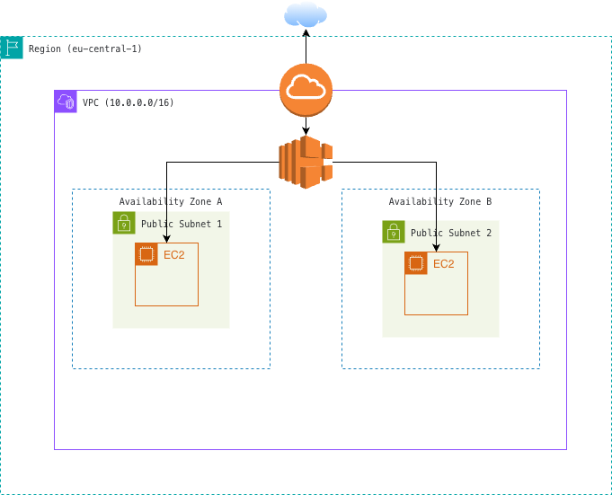

# Secure Multi-AZ Web Infrastructure on AWS

## 📌 Project Overview
This project demonstrates the deployment of a secure, highly available networking environment within AWS. The goal was to build a custom VPC capable of hosting a web application that can survive an Availability Zone failure.

## 🏗️ Architecture Diagram

## 🛠️ Tech Stack & Services
* **VPC:** Isolated network environment.
* **EC2:** Web servers hosting the application.
* **Internet Gateway:** Provided connectivity between the VPC and the internet.
* **Route Tables:** Configured to direct traffic from public subnets to the IGW.
* **Security Groups:** Acted as a virtual firewall for the EC2 instances.
* **Elastic Load Balancing:** Distributed incoming application traffic across multiple EC2 instances to ensure reliability.

## 🔒 Security Features
* **Principle of Least Privilege:** Security groups were configured to allow ONLY inbound HTTP traffic (Port 80). All other ports remain closed to minimize the attack surface.
* **Network Isolation:** Custom VPC design ensures full control over IP addressing and routing.

## 🚀 High Availability (HA)
* **Multi-AZ Deployment:** Instances are deployed across two different Availability Zones. If one AZ experiences an outage, the application remains reachable through the instance in the second AZ.
* **Load Balancing:** An Application Load Balancer acts as a single point of contact for clients, providing a DNS name and performing health checks to ensure traffic is only routed to functional instances.

